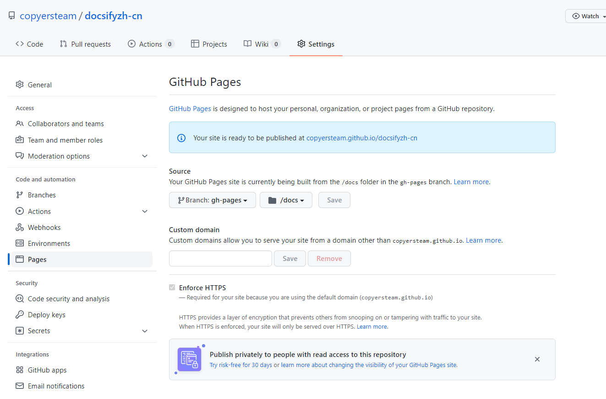

# 快速开始

推荐安装 `docsify-cli` 工具，可以方便创建及本地预览文档网站。

```bash
npm i docsify-cli -g
```
[cli文档](./docs/cli.md)
## 重要的文件

```text
index.html
summary.md
themes.md (切换主题的文件)
.nojekyll (避免被识别为jekyll)
nav.md (不是必须的,只是navbar)
```

## 部署到github pages

只需要把上面重要的文件放到gh-pages分支的docs文件夹,然后如图操作


## 初始化项目

如果想在项目的 `./docs` 目录里写文档，直接通过 `init` 初始化项目。

```bash
docsify init ./docs
```

## 开始写文档

初始化成功后，可以看到 `./docs` 目录下创建的几个文件

- `index.html` 入口文件
- `README.md` 会做为主页内容渲染
- `.nojekyll` 用于阻止 GitHub Pages 会忽略掉下划线开头的文件

直接编辑 `docs/README.md` 就能更新网站内容，当然也可以[写多个页面](zh-cn/more-pages.md)。

## 本地预览网站

运行一个本地服务器通过 `docsify serve` 可以方便的预览效果，而且提供 LiveReload 功能，可以让实时的预览。默认访问 <http://localhost:3000> 。

```bash
docsify serve docs
```

> 更多命令行工具用法，参考 [docsify-cli 文档](https://github.com/docsifyjs/docsify-cli)。

## 手动初始化

如果不喜欢 npm 或者觉得安装工具太麻烦，我们其实只需要直接创建一个 `index.html` 文件。

*index.html*

```html
<!DOCTYPE html>
<html lang="en">
  <head>
    <meta charset="UTF-8" />
    <title>Document</title>
    <link rel="icon" href="_media/favicon.ico" />
    <meta http-equiv="X-UA-Compatible" content="IE=edge,chrome=1" />
    <meta name="description" content="Description" />
    <meta
      name="viewport"
      content="width=device-width, user-scalable=no, initial-scale=1.0, maximum-scale=1.0, minimum-scale=1.0"
    />
    <link
      rel="stylesheet"
      href="//cdn.jsdelivr.net/npm/docsify@4/lib/themes/vue.css"
      title="vue"
    />
    <link
      rel="stylesheet"
      href="//cdn.jsdelivr.net/npm/docsify@4/lib/themes/dark.css"
      title="dark"
    />
    <link
      rel="stylesheet"
      href="//cdn.jsdelivr.net/npm/docsify@4/lib/themes/buble.css"
      title="buble"
      disabled=""
    />
    <link
      rel="stylesheet"
      href="//cdn.jsdelivr.net/npm/docsify@4/lib/themes/pure.css"
      title="pure"
      disabled=""
    />
    <link
      rel="stylesheet"
      href="https://cdn.jsdelivr.net/npm/docsify-themeable/dist/css/theme-simple-dark.css"
      title="docsify-themeable"
      disabled="disabled"
    />
  </head>

  <body>
    <div id="app">加载中:100:</div>

    <script>
      window.$docsify = {
        loadSidebar: "SUMMARY.md",
        loadNavbar: true,
        // basePath: "/docs/",
        subMaxLevel: 2,
        copyCode: {
          buttonText: "复制",
          errorText: "Error",
          successText: "已复制",
        },
        name: "docsify",
        repo: "",
        pagination: {
          previousText: "上一章节",
          nextText: "下一章节",
        },
        search: "auto", // 默认值

        search: [
          "/", // => /README.md
          "/guide", // => /guide.md
          "/get-started", // => /get-started.md
          "/docs", // => /zh-cn/README.md
        ],

        // 完整配置参数
        search: {
          noData: {
            "/de-de/": "Keine Ergebnisse!",
            "/": "没有结果!",
          },
          paths: "auto",
          placeholder: {
            "/de-de/": "Suche",
            "/": "搜索",
          },
        },
        executeScript: true,
      };
    </script>
    <script src="https://cdn.jsdelivr.net/npm/docsify@4.12.2/lib/docsify.min.js"></script>
    <!-- <script src="//unpkg.com/docsify-copy-code@2"></script> -->
    <script src="https://cdn.jsdelivr.net/npm/prismjs@1.26.0/components/prism-java.js"></script>
    <script src="https://unpkg.com/docsify-copy-code"></script>
    <script src="https://cdn.jsdelivr.net/npm/docsify@4.12.2/lib/plugins/emoji.min.js"></script>
    <script src="//unpkg.com/docsify-pagination/dist/docsify-pagination.min.js"></script>
    <script src="https://cdn.jsdelivr.net/npm/docsify@4.12.2/lib/plugins/search.min.js"></script>

    <script>
      var preview = Docsify.dom.find(".demo-theme-preview");
      var themes = Docsify.dom.findAll('[rel="stylesheet"]');

      preview.onclick = function (e) {
        var title = e.target.getAttribute("data-theme");

        themes.forEach(function (theme) {
          theme.disabled = theme.title !== title;
        });
      };
    </script>
  </body>
</html>

```
 
## Loading 提示

初始化时会显示 `Loading...` 内容，你可以自定义提示信息。

*index.html*

```html
  <div id="app">加载中</div>
```

如果更改了 `el` 的配置，需要将该元素加上 `data-app` 属性。

*index.html*

```html
  <div data-app id="main">加载中</div>

  <script>
    window.$docsify = {
      el: '#main'
    }
  </script>
```
